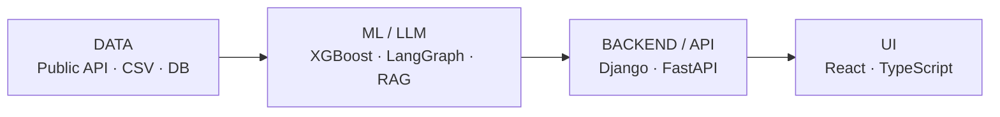

<h1 align="center">Full-Stack Developer</h1>

  <strong>데이터와 모델이 API를 거쳐 사용자 경험으로 이어지는 전체 흐름을 연결합니다.</strong> 
  <code>Public API</code> → <code>ML / LLM</code> → <code>Django / FastAPI</code> → <code>React / TypeScript</code>

  <a href="https://minhyeok328.github.io/">Portfolio</a> ·
  <a href="mailto:tjalsgur328@gmail.com">Email</a>

---

## System Flow

## About Me

다섯 차례의 팀 프로젝트를 통해 공공 API·CSV 데이터 수집과 정규화, 머신러닝 실험, LangGraph·RAG 파이프라인, Django·FastAPI 기반 시스템 연동, React·TypeScript UI 구현까지 AI 서비스의 전체 흐름을 경험했습니다.

프로젝트마다 직접 맡은 범위는 달랐지만, 데이터와 모델 결과가 API와 상태 관리를 거쳐 사용자 화면에 도달하는 과정을 구현하고 연결해 왔습니다. 프론트엔드·백엔드·LLM을 분리된 기술로만 보지 않고, 각 영역의 경계를 이해하며 필요한 기술을 하나의 서비스 흐름으로 연결합니다.

## Core Competencies

<table>
  <tr>
    <td width="50%" valign="top">
      <strong>01 · Service Flow</strong>  
      외부 데이터 수집과 전처리부터 ML·LLM 결과, 백엔드 API, 사용자 UI까지 이어지는 흐름을 이해하고 연결합니다.
    </td>
    <td width="50%" valign="top">
      <strong>02 · Full-Stack Web</strong>  
      React·TypeScript와 Django Templates로 UI를 구현하고, Django ORM과 Django·FastAPI 기반 API를 연동합니다.
    </td>
  </tr>
  <tr>
    <td width="50%" valign="top">
      <strong>03 · LLM &amp; Data</strong>  
      LangGraph·RAG와 구조화 출력을 구현하고, pandas·scikit-learn·XGBoost로 데이터와 모델 결과를 서비스 기능에 연결합니다.
    </td>
    <td width="50%" valign="top">
      <strong>04 · Reliability</strong>  
      런타임 응답 검증, 인증·비동기 상태, 오류·요청 취소, 테스트·QA와 인터페이스 문서화를 함께 다룹니다.
    </td>
  </tr>
</table>

## Flagship Project

> ### [HumouR](https://github.com/minhyeok328/Final_project) · AI 기반 채용 운영 서비스
>
> 기업 정보, 채용 공고, 평가 체크리스트, 지원서 분석, 분석 리포트, 면접 질문, 외부 제한 공유와 문서 챗을 하나의 업무 흐름으로 연결한 팀 프로젝트입니다.
>
> `React 19` · `TypeScript` · `TanStack Query` · `Zod`
>
> 현재 공개 운영 중인 프로덕션 서비스로 소개하는 것은 아닙니다.

**역할:** React 19·TypeScript 프론트엔드의 애플리케이션 구조와 서비스 통합을 담당했습니다.

| 기여 경계 | 기술과 범위 |
| --- | --- |
| **직접 구현·검증** | React 19 · TypeScript · Axios · TanStack Query · Zod · Ant Design · Vitest · MSW · Playwright |
| **팀 시스템 연동** | Django API · Celery 비동기 상태 · LangGraph/Pinecone 분석 결과 · RunPod/AWS 배포 구성 |

- **구조와 계약:** Axios·CSRF 공통 요청 계층부터 도메인 API Client, Zod 응답 검증, Adapter, TanStack Query로 이어지는 데이터 경계를 설계했습니다.
- **안정적인 사용자 흐름:** 일반 계정과 제한 API Key 세션의 권한·캐시를 격리하고, 인증 만료·요청 취소·오래된 응답·오류·캐시 수명주기를 함께 처리했습니다.
- **통합과 검증:** JD·지원서·분석 리포트·면접 질문·외부 공유·문서 챗의 화면과 API 흐름을 통합하고, 프론트엔드 테스트·QA 및 코드·API 문서 정합성 관리에 기여했습니다.
- **팀 전체 검증 자산:** 팀 저장소에는 테스트 파일 53개와 검증 스크립트 16개가 포함되어 있으며, 이 중 프론트엔드 테스트 체계의 구축·확장에 기여했습니다.

## Project Journey

> 아래 5개 프로젝트는 모두 팀 프로젝트이며, `직접 기여`에는 제가 맡아 구현하거나 검증한 범위만 적었습니다.

| Stage | Project | 직접 기여 | 근거와 결과 |
| --- | --- | --- | --- |
| **01 · Data Integration** | [TCO Insight](https://github.com/minhyeok328/1st_project) 차량 운영비 기준선 계산 | 공공 연비 API JSON 정규화, CSV 로드·파싱, 비용 모델과 데이터 흐름 문서화 | 외부 데이터 → DB·서비스 입력값 |
| **02 · ML Experimentation** | [신용카드 고객 이탈 분석](https://github.com/minhyeok328/2nd_project) | 전처리 탐색 노트북, Unknown 소득 범주 보완을 위한 XGBoost 분류 실험, EDA·Streamlit 화면 | 다중 분류 한계 → Low/High 이진 문제 재정의 |
| **03 · LLM & RAG** | [PICKLE 맛집 추천 챗봇](https://github.com/minhyeok328/3rd_project) | LangGraph 상태 그래프, OpenAI strict JSON Schema 슬롯 추출, SQLite 검색 연동, Streamlit UI, 내부 평가 | route·payload·target·answer·retrieval 전체 통과율 46%→82% 후보 내 타깃 포함률 52%→96% |
| **04 · Web Integration** | [LG Home AI 가전 상담](https://github.com/minhyeok328/4th_project) | Figma 사용자 흐름, Django SSR 화면, 검색·필터 상태, 찜·채팅 통신, 안전한 AI 응답 렌더링과 모바일 UX | 847개 가전의 검색·상세·AI 상담·RAG 흐름 통합 |
| **05 · Frontend Flagship** | [HumouR](https://github.com/minhyeok328/Final_project) | React·TypeScript 프론트엔드 구조, API 계약·인증·세션·비동기 상태·테스트·QA 구조화 | 인증·비동기·오류·검증 경계를 갖춘 화면 구조 |

> **범위 안내:** TCO Insight는 차량 구매비·감가상각·보험·금융비용 전체가 아닌 비교용 운영비 기준선을 계산합니다. PICKLE 수치는 동일한 데이터베이스를 기준으로 고정 질의 20개와 임베딩 질의 30개를 세 차례 반복 평가한 내부 자동 평가 결과이며 프로덕션 정확도가 아닙니다. LG Home AI는 공식 LG 서비스가 아닌 학습용 팀 프로젝트입니다.

## Tech Stack

기술을 넓게 나열하기보다 직접 구현한 영역과 팀 시스템을 연동한 영역을 구분했습니다.

- **Frontend 핵심:** `React` · `TypeScript` · `JavaScript` · `Axios` · `TanStack Query` · `Zod`
- **UI 구현:** `Figma` · `Tailwind CSS` · `Ant Design` · `Django Templates` · `Streamlit`
- **LLM 직접 구현:** `LangGraph` · `LangChain` · `RAG` · `OpenAI API` · `Structured Output`
- **Backend·Data 직접 사용:** `Python` · `Django ORM` · `pandas` · `scikit-learn` · `XGBoost` · `SQLite`
- **팀 시스템 연동:** `Django REST API` · `FastAPI` · `MySQL` · `Celery` · `MLflow` · `Pinecone` · `RunPod` · `AWS` · `Docker` · `GitHub Actions`
- **검증·협업:** `Vitest` · `Testing Library` · `MSW` · `Playwright` · `Git/GitHub`

## How I Build

- **계약을 먼저 정의합니다:** 요청·응답 구조와 책임 경계를 문서화하고 Zod와 타입으로 런타임까지 검증합니다.
- **실패 상태를 함께 설계합니다:** 정상 화면뿐 아니라 로딩·오류·인증 만료·요청 취소·비동기 상태까지 사용자 흐름에 포함합니다.
- **검증 결과를 팀의 기준으로 남깁니다:** 내부 평가·정적 QA·자동 테스트를 반복하고 코드와 인터페이스 문서를 동기화합니다.

## Other Work

- [codex_subagent](https://github.com/minhyeok328/codex_subagent): Codex 서브에이전트 오케스트레이션, 재사용 가능한 규칙과 문서 검증 방식을 탐구한 저장소입니다.

## GitHub Activity

  
  

